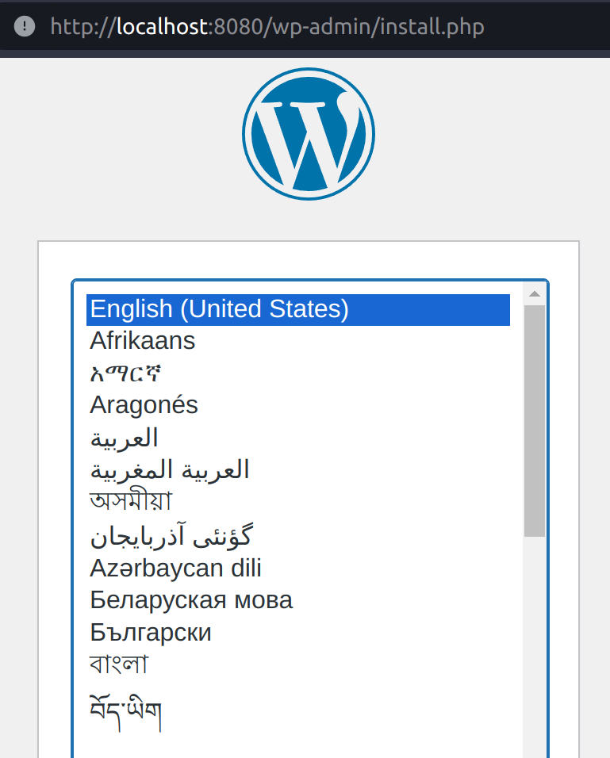

Docker-compose: better together
===============================

Docker containers are super powerful when isolated, but even more powerful when user together.
However, setting up the relationship and managing containers can get very messy very quickly.

.. _Docker-compose: https://docs.docker.com/compose/
.. _microservices: https://www.redhat.com/en/topics/microservices/what-are-microservices

To solve that, in a world of `microservices`_, `Docker-compose`_ was created.

.. _YAML: https://yaml.org/

The docker-compose.yml file
----------------------------

As the extension suggests, docker-compose microservices are defined via a `YAML`_ file.

Each service is described by a name and an image, for example the service ``ubuntu`` using
the container image ``ubuntu:22.04``:

.. sourcecode:: yaml

    services:
        ubuntu:
            image: ubuntu:22.04

.. _LinuxServer's nginx: https://hub.docker.com/r/linuxserver/nginx

Typically though, you are likely to see port and volume mappings, a container name,
restart policy and environment variables used to configure the server.
Using the example of the `LinuxServer's nginx`_ image:

.. sourcecode:: yaml

    services:
      nginx:
        image: lscr.io/linuxserver/nginx:latest
        container_name: nginx
        environment:
          - PUID=1000
          - PGID=1000
          - TZ=Etc/UTC
        volumes:
          - ./nginx_data:/config
        ports:
          - 80:80
          - 443:443
        restart: unless-stopped

Running docker-compose services
-------------------------------

To create the container and start it, we use the ``docker-compose up -d`` command.
Since I can't use those lower range ports, I'm replacing them with 8080 and 8443.

.. sourcecode:: console

    $ docker-compose up -d
    Creating network "oran_testbed_docs_default" with the default driver
    Pulling nginx (lscr.io/linuxserver/nginx:latest)...
    latest: Pulling from linuxserver/nginx
    e17344a03a1f: Pull complete
    07a0e16f7be1: Pull complete
    85b9c0ea220a: Pull complete
    109c94cd8876: Pull complete
    15d4551eb88e: Pull complete
    224d9e9f6d7a: Pull complete
    fa68b884f0e7: Pull complete
    46af7d502d5c: Pull complete
    Digest: sha256:b022f503603da72a66a3d07f142c791257dcc682c7a4749881aecf0dc615b266
    Status: Downloaded newer image for lscr.io/linuxserver/nginx:latest
    Creating nginx ... done
    $ docker container ls
    CONTAINER ID   IMAGE                              COMMAND                  CREATED             STATUS             PORTS                                                                            NAMES
    1ad2604f8ed2   lscr.io/linuxserver/nginx:latest   "/init"                  14 seconds ago      Up 13 seconds      0.0.0.0:8080->80/tcp, :::8080->80/tcp, 0.0.0.0:8443->443/tcp, :::8443->443/tcp   nginx
    2406929926a9   registry:2                         "/entrypoint.sh /etc…"   About an hour ago   Up About an hour   0.0.0.0:5000->5000/tcp, :::5000->5000/tcp

As we can see, the nginx service was created and its associated container was initiated.
To connect to the container, we can use good old ``docker exec -it nginx bash``

.. sourcecode:: console

    $ docker exec -it nginx bash
    root@1ad2604f8ed2:/# ps aux
    USER         PID %CPU %MEM    VSZ   RSS TTY      STAT START   TIME COMMAND
    root         214  0.0  0.0  49656 13484 ?        Ss   16:52   0:00 nginx: master process /usr/sbin/nginx
    root         215  0.0  0.0 227780 30188 ?        Ss   16:52   0:00 php-fpm: master process (/etc/php82/php-fpm.conf)
    abc          245  0.0  0.0  50120  5116 ?        S    16:52   0:00 nginx: worker process
    ...

If we look at the nginx_data, we are going to see files created by the initial setup of the server.

.. sourcecode:: console

    $ tree ./nginx_data
    nginx_data/
    ├── keys
    │   ├── cert.crt
    │   └── cert.key
    ├── log
    │   ├── nginx
    │   │   ├── access.log
    │   │   └── error.log
    │   └── php
    │       └── error.log
    ├── nginx
    │   ├── dhparams.pem
    │   ├── nginx.conf
    │   ├── nginx.conf.sample
    │   ├── resolver.conf
    │   ├── site-confs
    │   │   ├── default.conf
    │   │   └── default.conf.sample
    │   ├── ssl.conf
    │   ├── ssl.conf.sample
    │   └── worker_processes.conf
    ├── php
    │   ├── php-local.ini
    │   └── www2.conf
    └── www
        └── index.html

    8 directories, 17 files

For security reasons, some of these can be made readonly (logs are a clear exception).

A different way to check out of the services are working is using ``docker-compose ps``.

.. sourcecode:: console

    $ docker-compose ps
    Name    Command   State                                      Ports
    ------------------------------------------------------------------------------------------------------
    nginx   /init     Up      0.0.0.0:8443->443/tcp,:::8443->443/tcp, 0.0.0.0:8080->80/tcp,:::8080->80/tcp

Stopping docker-compose services
--------------------------------

To stop the services, use ``docker-compose stop``.
To stop the services and tear them down, use ``docker-compose down``.

.. sourcecode:: console

    $ docker-compose stop
    Stopping nginx ... done
    $ docker-compose down
    Removing nginx ... done
    Removing network oran_testbed_docs_default

Setting up virtual networks between service containers
------------------------------------------------------

Each docker container is connected to a virtual network to the host computer. Which means services
are isolated from one another, except for exposed mounts or ports.

That is not always desirable, in case the services need to exchange messages between them.

Let's see the following example with two containers pinging each other.

.. sourcecode:: yaml

    pinger1_service:
      hostname: pinger1
      image: nginx:latest
      command: bash -c "apt update && apt install -y iputils-ping; ping -c 10 pinger2"

    pinger2_service:
      hostname: pinger2
      image: nginx:latest
      command: bash -c "apt update && apt install -y iputils-ping; ping -c 10 pinger1"

.. sourcecode:: console

    $docker-compose up
    Creating oran_testbed_docs_pinger1_service_1 ... done
    Creating oran_testbed_docs_pinger2_service_1 ... done
    Attaching to oran_testbed_docs_pinger1_service_1, oran_testbed_docs_pinger2_service_1
    pinger1_service_1  |
    pinger1_service_1  | WARNING: apt does not have a stable CLI interface. Use with caution in scripts.
    pinger1_service_1  |
    pinger2_service_1  |
    pinger2_service_1  | WARNING: apt does not have a stable CLI interface. Use with caution in scripts.
    pinger2_service_1  |
    pinger2_service_1  | Get:1 http://deb.debian.org/debian bookworm InRelease [151 kB]
    pinger1_service_1  | Get:1 http://deb.debian.org/debian bookworm InRelease [151 kB]
    pinger2_service_1  | Get:2 http://deb.debian.org/debian bookworm-updates InRelease [52.1 kB]
    pinger2_service_1  | Get:3 http://deb.debian.org/debian-security bookworm-security InRelease [48.0 kB]
    pinger1_service_1  | Get:2 http://deb.debian.org/debian bookworm-updates InRelease [52.1 kB]
    pinger1_service_1  | Get:3 http://deb.debian.org/debian-security bookworm-security InRelease [48.0 kB]
    pinger2_service_1  | Get:4 http://deb.debian.org/debian bookworm/main amd64 Packages [8780 kB]
    pinger1_service_1  | Get:4 http://deb.debian.org/debian bookworm/main amd64 Packages [8780 kB]
    pinger2_service_1  | Get:5 http://deb.debian.org/debian bookworm-updates/main amd64 Packages [6668 B]
    pinger2_service_1  | Get:6 http://deb.debian.org/debian-security bookworm-security/main amd64 Packages [105 kB]
    pinger2_service_1  | Fetched 9143 kB in 2s (5350 kB/s)
    pinger2_service_1  | Reading package lists...
    pinger2_service_1  | Building dependency tree...
    pinger2_service_1  | Reading state information...
    pinger2_service_1  | 1 package can be upgraded. Run 'apt list --upgradable' to see it.
    ...
    pinger1_service_1  | Setting up iputils-ping (3:20221126-1) ...
    pinger2_service_1  | ping: pinger1: Name or service not known
    oran_testbed_docs_pinger2_service_1 exited with code 2
    pinger1_service_1  | ping: pinger2: Temporary failure in name resolution
    oran_testbed_docs_pinger1_service_1 exited with code 2

As we can see, DNS resolution failed since the services are not part of the same group,
so they are completely isolated.

If we create multiple services under the same umbrella, those container are connected to the same
network and have automatic DNS name resolution.

.. sourcecode:: yaml

    services:
      pinger1_service:
        hostname: pinger1
        image: nginx:latest
        command: bash -c "apt update && apt install -y iputils-ping; ping -c 10 pinger2"

      pinger2_service:
        hostname: pinger2
        image: nginx:latest
        command: bash -c "apt update && apt install -y iputils-ping; ping -c 10 pinger1"

After running ``docker-compose up`` we get:

.. sourcecode:: console

    $ docker-compose up
    Starting oran_testbed_docs_pinger1_service_1 ... done
    Starting oran_testbed_docs_pinger2_service_1 ... done
    Attaching to oran_testbed_docs_pinger2_service_1, oran_testbed_docs_pinger1_service_1
    pinger2_service_1  |
    pinger2_service_1  | WARNING: apt does not have a stable CLI interface. Use with caution in scripts.
    pinger2_service_1  |
    pinger1_service_1  |
    pinger1_service_1  | WARNING: apt does not have a stable CLI interface. Use with caution in scripts.
    pinger1_service_1  |
    pinger1_service_1  | Hit:1 http://deb.debian.org/debian bookworm InRelease
    pinger1_service_1  | Hit:2 http://deb.debian.org/debian bookworm-updates InRelease
    ...
    pinger1_service_1  | iputils-ping is already the newest version (3:20221126-1).
    pinger1_service_1  | 0 upgraded, 0 newly installed, 0 to remove and 1 not upgraded.
    pinger1_service_1  | PING pinger2 (172.22.0.3) 56(84) bytes of data.
    pinger1_service_1  | 64 bytes from oran_testbed_docs_pinger2_service_1.oran_testbed_docs_default (172.22.0.3): icmp_seq=1 ttl=64 time=0.063 ms
    pinger2_service_1  | iputils-ping is already the newest version (3:20221126-1).
    pinger2_service_1  | 0 upgraded, 0 newly installed, 0 to remove and 1 not upgraded.
    pinger2_service_1  | PING pinger1 (172.22.0.2) 56(84) bytes of data.
    pinger2_service_1  | 64 bytes from oran_testbed_docs_pinger1_service_1.oran_testbed_docs_default (172.22.0.2): icmp_seq=1 ttl=64 time=0.059 ms
    pinger1_service_1  | 64 bytes from oran_testbed_docs_pinger2_service_1.oran_testbed_docs_default (172.22.0.3): icmp_seq=2 ttl=64 time=0.074 ms
    pinger2_service_1  | 64 bytes from oran_testbed_docs_pinger1_service_1.oran_testbed_docs_default (172.22.0.2): icmp_seq=2 ttl=64 time=0.072 ms
    pinger1_service_1  | 64 bytes from oran_testbed_docs_pinger2_service_1.oran_testbed_docs_default (172.22.0.3): icmp_seq=3 ttl=64 time=0.082 ms
    pinger2_service_1  | 64 bytes from oran_testbed_docs_pinger1_service_1.oran_testbed_docs_default (172.22.0.2): icmp_seq=3 ttl=64 time=0.076 ms
    pinger1_service_1  | 64 bytes from oran_testbed_docs_pinger2_service_1.oran_testbed_docs_default (172.22.0.3): icmp_seq=4 ttl=64 time=0.081 ms
    pinger2_service_1  | 64 bytes from oran_testbed_docs_pinger1_service_1.oran_testbed_docs_default (172.22.0.2): icmp_seq=4 ttl=64 time=0.070 ms
    pinger1_service_1  | 64 bytes from oran_testbed_docs_pinger2_service_1.oran_testbed_docs_default (172.22.0.3): icmp_seq=5 ttl=64 time=0.075 ms
    pinger2_service_1  | 64 bytes from oran_testbed_docs_pinger1_service_1.oran_testbed_docs_default (172.22.0.2): icmp_seq=5 ttl=64 time=0.071 ms
    pinger1_service_1  | 64 bytes from oran_testbed_docs_pinger2_service_1.oran_testbed_docs_default (172.22.0.3): icmp_seq=6 ttl=64 time=0.068 ms
    pinger2_service_1  | 64 bytes from oran_testbed_docs_pinger1_service_1.oran_testbed_docs_default (172.22.0.2): icmp_seq=6 ttl=64 time=0.045 ms
    pinger1_service_1  | 64 bytes from oran_testbed_docs_pinger2_service_1.oran_testbed_docs_default (172.22.0.3): icmp_seq=7 ttl=64 time=0.074 ms
    ^CGracefully stopping... (press Ctrl+C again to force)
    Stopping oran_testbed_docs_pinger2_service_1 ... done
    Stopping oran_testbed_docs_pinger1_service_1 ... done

As we can see, now everything works just fine.

However, IPs from the containers may change over time, which is less then ideal for
permanently hosted services or services that accept only IP addresses. In this case,
we can explicitly create and configure a virtual network.

.. sourcecode:: yaml

    networks:
      net1:
        driver: bridge
        ipam:
          driver: default
          config:
            - subnet: 101.1.1.0/24

    services:
      pinger1_service:
        hostname: pinger1
        image: nginx:latest
        command: bash -c "apt update && apt install -y iputils-ping; ping -c 20 pinger2"
        networks:
          net1:
            ipv4_address: 101.1.1.2

      pinger2_service:
        hostname: pinger2
        image: nginx:latest
        command: bash -c "apt update && apt install -y iputils-ping; ping -c 20 pinger1"
        networks:
          net1:
            ipv4_address: 101.1.1.3

We get the following output:

.. sourcecode:: console

    $ docker-compose up
    Recreating oran_testbed_docs_pinger2_service_1 ... done
    Recreating oran_testbed_docs_pinger1_service_1 ... done
    Attaching to oran_testbed_docs_pinger2_service_1, oran_testbed_docs_pinger1_service_1
    ...
    pinger2_service_1  | PING pinger1 (101.1.1.2) 56(84) bytes of data.
    pinger2_service_1  | 64 bytes from oran_testbed_docs_pinger1_service_1.oran_testbed_docs_net1 (101.1.1.2): icmp_seq=1 ttl=64 time=0.073 ms
    pinger1_service_1  | Setting up iputils-ping (3:20221126-1) ...
    pinger1_service_1  | PING pinger2 (101.1.1.3) 56(84) bytes of data.
    pinger1_service_1  | 64 bytes from oran_testbed_docs_pinger2_service_1.oran_testbed_docs_net1 (101.1.1.3): icmp_seq=1 ttl=64 time=0.072 ms
    pinger2_service_1  | 64 bytes from oran_testbed_docs_pinger1_service_1.oran_testbed_docs_net1 (101.1.1.2): icmp_seq=2 ttl=64 time=0.072 ms
    pinger1_service_1  | 64 bytes from oran_testbed_docs_pinger2_service_1.oran_testbed_docs_net1 (101.1.1.3): icmp_seq=2 ttl=64 time=0.053 ms
    pinger2_service_1  | 64 bytes from oran_testbed_docs_pinger1_service_1.oran_testbed_docs_net1 (101.1.1.2): icmp_seq=3 ttl=64 time=0.073 ms

Interdependent containers
-------------------------

.. _ACID: https://www.geeksforgeeks.org/acid-properties-in-dbms/
.. _Wordpress: https://wordpress.org/
.. _MySQL: https://www.mysql.com/
.. _SQLite: https://www.sqlite.org/index.html
.. _PostgreSQL: https://www.postgresql.org/

A common service requirement is a SQL database service to store data in an `ACID`_ manner.
The `Wordpress`_ CMS, for example, depends on either a `SQLite`_ (disk-based database, don't need a
separate host, but isn't meant for concurrent access), `MySQL`_ or `PostgreSQL`_.

.. _Wordpress container image: https://hub.docker.com/_/wordpress
.. _Docker Hub: https://hub.docker.com/

The `Wordpress container image`_ in `Docker Hub`_ contains instructions on how to setup the wordpress
service and the required database service. The suggested ``docker-compose`` file is as follows:

.. sourcecode:: yaml

    services:
      wordpress:
        image: wordpress
        restart: always
        ports:
          - 8080:80
        environment:
          WORDPRESS_DB_HOST: db
          WORDPRESS_DB_USER: exampleuser
          WORDPRESS_DB_PASSWORD: examplepass
          WORDPRESS_DB_NAME: exampledb
        volumes:
          - wordpress:/var/www/html
      db:
        image: mysql:5.7
        restart: always
        environment:
          MYSQL_DATABASE: exampledb
          MYSQL_USER: exampleuser
          MYSQL_PASSWORD: examplepass
          MYSQL_RANDOM_ROOT_PASSWORD: '1'
        volumes:
          - db:/var/lib/mysql
    volumes:
      wordpress:
      db:

We can see the suggested database user, password and names. These are considered ``SECRETS``,
and should never be stored in cleartext files like this.

Note that the mounted volumes are not from the host system, but docker volumes ``wordpress`` and ``db``.
I don't recommend ever using these volumes to store services data or settings. But that is my opinion.

Let's run this to see how it behaves. At the end, we should be greeted by the Wordpress setup
wizard on ``localhost:8080``.

.. sourcecode:: console

    docker-compose up
    Creating network "oran_testbed_docs_default" with the default driver
    Creating volume "oran_testbed_docs_wordpress" with default driver
    Creating volume "oran_testbed_docs_db" with default driver
    Pulling wordpress (wordpress:)...
    latest: Pulling from library/wordpress
    b7f91549542c: Pulling fs layer
    ...
    b0e2f5156049: Pull complete
    Digest: sha256:824689613b4e7b027d0d36f264a53a159d6c7adcf5250539e56efe2940651e19
    Status: Downloaded newer image for wordpress:latest
    Pulling db (mysql:5.7)...
    5.7: Pulling from library/mysql
    11a38aebcb7a: Pulling fs layer
    ...
    ee9043dd2677: Pull complete
    Digest: sha256:f566819f2eee3a60cf5ea6c8b7d1bfc9de62e34268bf62dc34870c4fca8a85d1
    Status: Downloaded newer image for mysql:5.7
    Creating oran_testbed_docs_wordpress_1 ... done
    Creating oran_testbed_docs_db_1        ... done
    Attaching to oran_testbed_docs_db_1, oran_testbed_docs_wordpress_1
    db_1         | 2023-11-28 19:40:55+00:00 [Note] [Entrypoint]: Entrypoint script for MySQL Server 5.7.44-1.el7 started.
    wordpress_1  | WordPress not found in /var/www/html - copying now...
    db_1         | 2023-11-28 19:40:55+00:00 [Note] [Entrypoint]: Switching to dedicated user 'mysql'
    db_1         | 2023-11-28 19:40:55+00:00 [Note] [Entrypoint]: Entrypoint script for MySQL Server 5.7.44-1.el7 started.
    wordpress_1  | Complete! WordPress has been successfully copied to /var/www/html
    wordpress_1  | No 'wp-config.php' found in /var/www/html, but 'WORDPRESS_...' variables supplied; copying 'wp-config-docker.php' (WORDPRESS_DB_HOST WORDPRESS_DB_NAME WORDPRESS_DB_PASSWORD WORDPRESS_DB_USER)
    db_1         | 2023-11-28 19:40:56+00:00 [Note] [Entrypoint]: Initializing database files
    db_1         | 2023-11-28T19:40:56.255127Z 0 [Warning] TIMESTAMP with implicit DEFAULT value is deprecated. Please use --explicit_defaults_for_timestamp server option (see documentation for more details).
    wordpress_1  | AH00558: apache2: Could not reliably determine the server's fully qualified domain name, using 172.23.0.2. Set the 'ServerName' directive globally to suppress this message
    wordpress_1  | [Tue Nov 28 19:40:56.336165 2023] [mpm_prefork:notice] [pid 1] AH00163: Apache/2.4.56 (Debian) PHP/8.0.30 configured -- resuming normal operations
    wordpress_1  | [Tue Nov 28 19:40:56.336208 2023] [core:notice] [pid 1] AH00094: Command line: 'apache2 -D FOREGROUND'
    db_1         | 2023-11-28T19:40:56.602920Z 0 [Warning] InnoDB: New log files created, LSN=45790
    db_1         | 2023-11-28T19:40:56.649898Z 0 [Warning] InnoDB: Creating foreign key constraint system tables.
    ...
    db_1         | 2023-11-28T19:40:59.916125Z 0 [Note] mysqld (mysqld 5.7.44) starting as process 125 ...
    ...
    db_1         | 2023-11-28 19:41:02+00:00 [Note] [Entrypoint]: GENERATED ROOT PASSWORD: XZL8xdElzlWrvPEqgZpH6tFMtGg8BcRQ
    db_1         | 2023-11-28 19:41:02+00:00 [Note] [Entrypoint]: Creating database exampledb
    db_1         | 2023-11-28 19:41:02+00:00 [Note] [Entrypoint]: Creating user exampleuser
    db_1         | 2023-11-28 19:41:02+00:00 [Note] [Entrypoint]: Giving user exampleuser access to schema exampledb
    db_1         |
    db_1         | 2023-11-28 19:41:02+00:00 [Note] [Entrypoint]: Stopping temporary server
    ...
    db_1         | 2023-11-28 19:41:04+00:00 [Note] [Entrypoint]: MySQL init process done. Ready for start up.
    db_1         |
    db_1         | 2023-11-28T19:41:04.734809Z 0 [Warning] TIMESTAMP with implicit DEFAULT value is deprecated. Please use --explicit_defaults_for_timestamp server option (see documentation for more details).
    db_1         | 2023-11-28T19:41:04.736710Z 0 [Note] mysqld (mysqld 5.7.44) starting as process 1 ...
    db_1         | 2023-11-28T19:41:04.817339Z 0 [Note] Server hostname (bind-address): '*'; port: 3306
    db_1         | 2023-11-28T19:41:04.817392Z 0 [Note] IPv6 is available.
    db_1         | 2023-11-28T19:41:04.817414Z 0 [Note]   - '::' resolves to '::';
    db_1         | 2023-11-28T19:41:04.817437Z 0 [Note] Server socket created on IP: '::'.
    db_1         | 2023-11-28T19:41:04.818503Z 0 [Warning] Insecure configuration for --pid-file: Location '/var/run/mysqld' in the path is accessible to all OS users. Consider choosing a different directory.
    db_1         | 2023-11-28T19:41:04.826933Z 0 [Note] Event Scheduler: Loaded 0 events
    db_1         | 2023-11-28T19:41:04.827130Z 0 [Note] mysqld: ready for connections.
    db_1         | Version: '5.7.44'  socket: '/var/run/mysqld/mysqld.sock'  port: 3306  MySQL Community Server (GPL)
    wordpress_1  | 172.23.0.1 - - [28/Nov/2023:19:41:11 +0000] "GET / HTTP/1.1" 302 405 "-" "Mozilla/5.0 (X11; Linux x86_64) AppleWebKit/537.36 (KHTML, like Gecko) Chrome/119.0.0.0 Safari/537.36"
    ...

We can see that both services were started and that wordpress connected with the MySQL database.

After registering the wordpress site as ``umsite`` and the user as ``umusuario`` via the online
wizard, we check the database. We can do this using ``docker exec -it parentFolderName_containerName_num``,
as shown below.

.. sourcecode:: console

    $ docker exec -it oran_testbed_docs_db_1 bash
    bash-4.2# mysql --user=exampleuser --password=examplepass exampledb
    Reading table information for completion of table and column names
    You can turn off this feature to get a quicker startup with -A

    Welcome to the MySQL monitor.  Commands end with ; or \g.
    Your MySQL connection id is 10
    Server version: 5.7.44 MySQL Community Server (GPL)

    Copyright (c) 2000, 2023, Oracle and/or its affiliates.

    Oracle is a registered trademark of Oracle Corporation and/or its
    affiliates. Other names may be trademarks of their respective
    owners.

    Type 'help;' or '\h' for help. Type '\c' to clear the current input statement.

    mysql> SHOW TABLES;
    +-----------------------+
    | Tables_in_exampledb   |
    +-----------------------+
    | wp_commentmeta        |
    | wp_comments           |
    | wp_links              |
    | wp_options            |
    | wp_postmeta           |
    | wp_posts              |
    | wp_term_relationships |
    | wp_term_taxonomy      |
    | wp_termmeta           |
    | wp_terms              |
    | wp_usermeta           |
    | wp_users              |
    +-----------------------+
    12 rows in set (0.00 sec)

    mysql> SELECT * FROM wp_users;
    +----+------------+------------------------------------+---------------+----------------------+-----------------------+---------------------+---------------------+-------------+--------------+
    | ID | user_login | user_pass                          | user_nicename | user_email           | user_url              | user_registered     | user_activation_key | user_status | display_name |
    +----+------------+------------------------------------+---------------+----------------------+-----------------------+---------------------+---------------------+-------------+--------------+
    |  1 | umusuario  | $P$B3A4XjATLk1HuMksgqvM9S6gdNeiUQ0 | umusuario     | emailfalso@gmail.com | http://localhost:8080 | 2023-11-28 19:55:43 |                     |           0 | umusuario    |
    +----+------------+------------------------------------+---------------+----------------------+-----------------------+---------------------+---------------------+-------------+--------------+
    1 row in set (0.00 sec)

    mysql>EXIT;
    Bye
    bash-4.2# exit

As shown above, we have updated the database with the new user via the Wordpress wizard.
After tearing down the setup, those two volumes for ``wordpress`` and ``db`` files will be kept.

.. sourcecode:: console

    $ docker-compose down
    Removing oran_testbed_docs_db_1        ... done
    Removing oran_testbed_docs_wordpress_1 ... done
    Removing network oran_testbed_docs_default
    $ docker volume ls
    DRIVER    VOLUME NAME
    local     oran_testbed_docs_db
    local     oran_testbed_docs_wordpress

Those volumes can be mounted by containers for inspection/data extraction.

.. sourcecode:: console

    $ docker run -it -v oran_testbed_docs_db:/db ubuntu:23.04
    Unable to find image 'ubuntu:23.04' locally
    23.04: Pulling from library/ubuntu
    f93f952dad40: Pull complete
    Digest: sha256:51e70689b125fcc2e800f5efb7ba465dee85ede9da9c268ff5599053c7e52b77
    Status: Downloaded newer image for ubuntu:23.04
    root@08ebebd718d8:/# ls /db/
    auto.cnf    ca.pem           client-key.pem  ib_buffer_pool  ib_logfile1  mysql       performance_schema  public_key.pem   server-key.pem
    ca-key.pem  client-cert.pem  exampledb       ib_logfile0     ibdata1      mysql.sock  private_key.pem     server-cert.pem  sys

And can also be deleted if no container is currently attached to them.
Which is the reason I don't recommend using them in the first place.

.. sourcecode:: console

    $ docker container prune
    WARNING! This will remove all stopped containers.
    Are you sure you want to continue? [y/N] y
    Deleted Containers:
    08ebebd718d8b20e40848c11e1dad663022e9f3dc633eb105f24d7b165b0ba47

    Total reclaimed space: 13B
    $ docker volume prune -a
    WARNING! This will remove all local volumes not used by at least one container.
    Are you sure you want to continue? [y/N] y
    Deleted Volumes:
    oran_testbed_docs_wordpress
    oran_testbed_docs_db

    Total reclaimed space: 278.3MB

.. _compose-file documentation: https://docs.docker.com/compose/compose-file/05-services/#depends_on

Containers that require some startup ordering must explicitly list other containers as required,
as specified in the `compose-file documentation`_.

Servers are expected to retry connections to ensure out-of-order initialization does not prevent
the services from starting.

