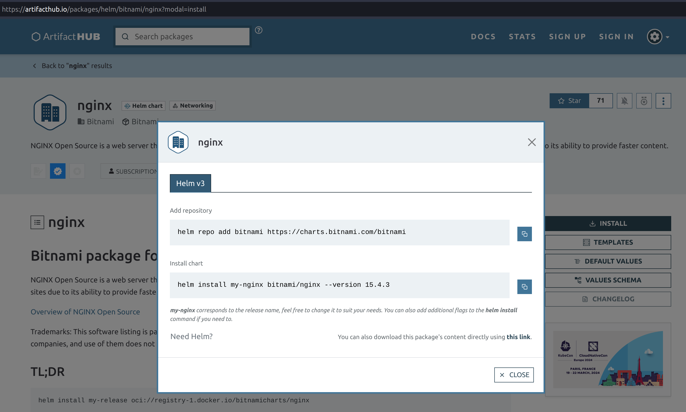
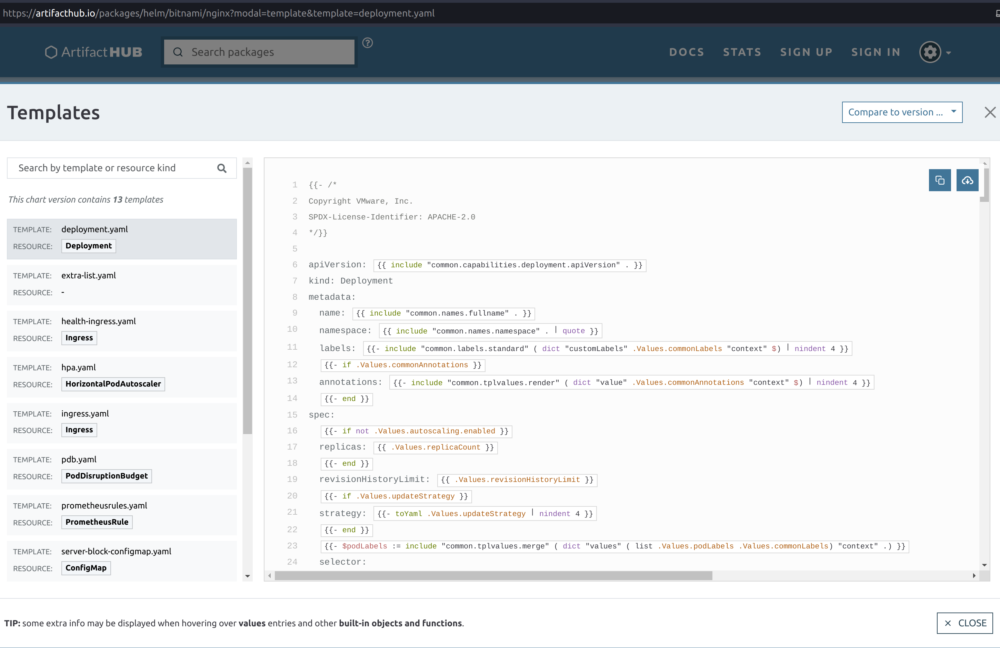
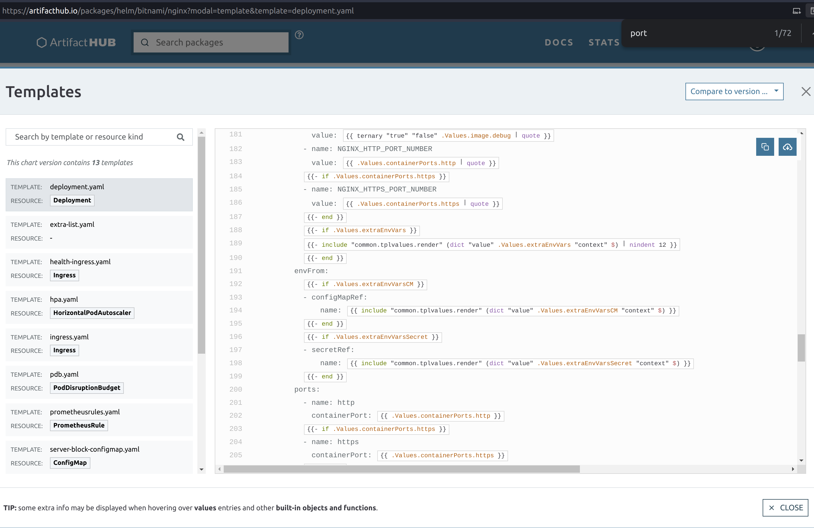

Helm
====

**Helm: containers + configuration templates = business**

One of the biggest limitations of Docker container images is that they encapsulate the
application, but not the controls of said application. That means it says nothing about
how to configure the application encapsulated, which may use environment variables,
configuration files, or command-line arguments, or a combination of all previous alternatives.

Since it is a pain to figure out what is needed per application and keep track of configuration
files that need to be replicated to other clusters, Kubernetes implements configuration templates
and maps, that are shipped with the container images in a what is known as a ``charts``. Charts are
distributed via the ``Helm chart manager``.

Helm gets installed by default with ``microk8s``, we just need to setup the alias,
like we did for ``kubectl``.

.. sourcecode:: console

    $ helm
    Command 'helm' not found, but can be installed with:
    sudo snap install helm
    $ sudo snap alias microk8s.helm3 helm
    $ helm
    The Kubernetes package manager

    Common actions for Helm:

    - helm search:    search for charts
    - helm pull:      download a chart to your local directory to view
    - helm install:   upload the chart to Kubernetes
    - helm list:      list releases of charts
    ...

.. _ArtifactHub.io: https://artifacthub.io/

Now, let's see how we can probe for available settings of a deployed chart.
Yet again, we are going to use nginx as an example.

Deploying a Helm chart
----------------------

We can simply search then install via Helm, which will fetch charts available at `ArtifactHub.io`_.

.. sourcecode:: console

    $ helm search hub nginx
    URL                                                     CHART VERSION   APP VERSION                             DESCRIPTION
    https://artifacthub.io/packages/helm/ashu-nginx...      0.1.0           1.16.0                                  A Helm chart for Kubernetes
    https://artifacthub.io/packages/helm/krakazyabr...      1.0.0           1.19.0                                  Nginx Helm chart for Kubernetes
    https://artifacthub.io/packages/helm/shubhamtat...      0.1.12          1.19.6                                  Nginx Helm chart for Kubernetes
    https://artifacthub.io/packages/helm/bitnami/nginx      15.4.3          1.25.3                                  NGINX Open Source is a web server that can be a...
    ...

.. _binami URL entry for nginx: https://artifacthub.io/packages/helm/bitnami/nginx

By looking at the `binami URL entry for nginx`_, we can get the installation instructions:

We follow the instructions, adding the new chart repository with ``helm repo add repo_name repo_url``
and then deploying the chart as a release ``helm install release_name chart_name``:

.. sourcecode:: console

    $ helm repo list
    Error: no repositories to show
    $ helm repo add bitnami https://charts.bitnami.com/bitnami
    "bitnami" has been added to your repositories
    $ helm repo list
    NAME    URL
    bitnami https://charts.bitnami.com/bitnami
    $ helm install nginx bitnami/nginx
    NAME: nginx
    LAST DEPLOYED: Thu Nov 30 14:25:15 2023
    NAMESPACE: default
    STATUS: deployed
    REVISION: 1
    TEST SUITE: None
    NOTES:
    CHART NAME: nginx
    CHART VERSION: 15.4.3
    APP VERSION: 1.25.3

    ** Please be patient while the chart is being deployed **
    NGINX can be accessed through the following DNS name from within your cluster:

        nginx.default.svc.cluster.local (port 80)

    To access NGINX from outside the cluster, follow the steps below:

    1. Get the NGINX URL by running these commands:

      NOTE: It may take a few minutes for the LoadBalancer IP to be available.
            Watch the status with: 'kubectl get svc --namespace default -w nginx'

        export SERVICE_PORT=$(kubectl get --namespace default -o jsonpath="{.spec.ports[0].port}" services nginx)
        export SERVICE_IP=$(kubectl get svc --namespace default nginx -o jsonpath='{.status.loadBalancer.ingress[0].ip}')
        echo "http://${SERVICE_IP}:${SERVICE_PORT}"

We can see that nginx was deployed using ``kubectl get deployments`` as done previously.

.. sourcecode:: console

    $ kubectl get deployments
    NAME    READY   UP-TO-DATE   AVAILABLE   AGE
    nginx   1/1     1            1           77s

Different from deploying straight from a Docker container, the chart should have also imported
the configuration templates associated with that container.

Configuring a Helm release (chart deployment)
---------------------------------------------

.. _official documentation: https://kubernetes.io/docs/tutorials/configuration/configure-redis-using-configmap/

Configuration maps are the way deployments are configured in Kubernetes.
Much more information can be found in the `official documentation`_.

Since we are already working on the nginx example, we are going to continue with it.

By looking at the `binami URL entry for nginx`_, we can look at the different
configuration templates included in the Helm chart.

We can also probe the configuration via the command line using ``helm get manifest deployment_name``.

.. sourcecode:: console

    $ helm get manifest nginx
    ---
    # Source: nginx/templates/svc.yaml
    apiVersion: v1
    kind: Service
    metadata:
      name: nginx
      namespace: "default"
      labels:
        app.kubernetes.io/instance: nginx
        app.kubernetes.io/managed-by: Helm
        app.kubernetes.io/name: nginx
        app.kubernetes.io/version: 1.25.3
        helm.sh/chart: nginx-15.4.3
      annotations:
    spec:
      type: LoadBalancer
      sessionAffinity: None
      externalTrafficPolicy: "Cluster"
      ports:
        - name: http
          port: 80
          targetPort: http
      selector:
        app.kubernetes.io/instance: nginx
        app.kubernetes.io/name: nginx
    ---
    # Source: nginx/templates/deployment.yaml
    apiVersion: apps/v1
    kind: Deployment
    metadata:
      name: nginx
      namespace: "default"
      labels:
        app.kubernetes.io/instance: nginx
        app.kubernetes.io/managed-by: Helm
        app.kubernetes.io/name: nginx
        app.kubernetes.io/version: 1.25.3
        helm.sh/chart: nginx-15.4.3
    spec:
      ...
      template:
        metadata:
          ...
        spec:
          ...
          initContainers:
          containers:
            - name: nginx
              image: docker.io/bitnami/nginx:1.25.3-debian-11-r1
              imagePullPolicy: "IfNotPresent"
              ...
              env:
                - name: BITNAMI_DEBUG
                  value: "false"
                - name: NGINX_HTTP_PORT_NUMBER
                  value: "8080"
              envFrom:
              ports:
                - name: http
                  containerPort: 8080
              ...
              resources:
                limits: {}
                requests: {}
              volumeMounts:
          volumes:

In the above list, we can see multiple configuration options and their default values.
For example, notice that the ``ports`` entry specifies the type of service and port
that should be exposed.
On top of that, we also have the environment variable ``NGINX_HTTP_PORT_NUMBER`` set to ``8080``.

By looking at the `binami URL entry for nginx`_, we can search for the variable names
that replace that get replaced by those values.

In the previous image, we can see that the ``.Values.containerPorts.http`` variable
controls both fields with the ``8080`` port.

The same output can be obtained via the terminal command that follows:

.. sourcecode:: console

    $ helm show values bitnami/nginx | grep param
    ## @section Global parameters
    ## Global Docker image parameters
    ## Please, note that this will override the image parameters, including dependencies, configured to use the global value
    ## Current available global Docker image parameters: imageRegistry, imagePullSecrets and storageClass
    ## @param global.imageRegistry Global Docker image registry
    ## @param global.imagePullSecrets Global Docker registry secret names as an array
    ## @section Common parameters
    ## @param nameOverride String to partially override nginx.fullname template (will maintain the release name)
    ...
    ## @param image.debug Set to true if you would like to see extra information on logs
    ## @param hostAliases Deployment pod host aliases
    ## @param command Override default container command (useful when using custom images)
    ## @param args Override default container args (useful when using custom images)
    ## @param extraEnvVars Extra environment variables to be set on NGINX containers
    ## @param extraEnvVarsCM ConfigMap with extra environment variables
    ## @param extraEnvVarsSecret Secret with extra environment variables
    ## @section NGINX deployment parameters
    ## @param replicaCount Number of NGINX replicas to deploy
    ...
    ## @param containerPorts.http Sets http port inside NGINX container
    ## @param containerPorts.https Sets https port inside NGINX container
    ...

And to change them both, we need to change
the value of ``.Values.containerPorts.https`` from the default one via a file
called ``values.yml`` containing the following.

.. sourcecode:: yaml

    containerPorts:
        http: 80

To apply those changes, we can use:

.. sourcecode:: console

    $ helm upgrade nginx bitnami/nginx --values values.yml
    Release "nginx" has been upgraded. Happy Helming!
    NAME: nginx
    LAST DEPLOYED: Thu Nov 30 16:02:55 2023
    NAMESPACE: default
    STATUS: deployed
    REVISION: 2
    TEST SUITE: None
    NOTES:
    CHART NAME: nginx
    CHART VERSION: 15.4.3
    APP VERSION: 1.25.3

    ** Please be patient while the chart is being deployed **
    NGINX can be accessed through the following DNS name from within your cluster:

        nginx.default.svc.cluster.local (port 80)

    To access NGINX from outside the cluster, follow the steps below:

    1. Get the NGINX URL by running these commands:

      NOTE: It may take a few minutes for the LoadBalancer IP to be available.
            Watch the status with: 'kubectl get svc --namespace default -w nginx'

        export SERVICE_PORT=$(kubectl get --namespace default -o jsonpath="{.spec.ports[0].port}" services nginx)
        export SERVICE_IP=$(kubectl get svc --namespace default nginx -o jsonpath='{.status.loadBalancer.ingress[0].ip}')
        echo "http://${SERVICE_IP}:${SERVICE_PORT}"

You will probably notice that the revision number went up after we upgraded our deployment.
We can then get the manifest to check if our changes were properly propagated.

.. sourcecode:: console

    $ helm get manifest nginx
    ---
    # Source: nginx/templates/svc.yaml
    apiVersion: v1
    kind: Service
    metadata:
      name: nginx
      namespace: "default"
      labels:
        app.kubernetes.io/instance: nginx
        app.kubernetes.io/managed-by: Helm
        app.kubernetes.io/name: nginx
        app.kubernetes.io/version: 1.25.3
        helm.sh/chart: nginx-15.4.3
      annotations:
    spec:
      type: LoadBalancer
      sessionAffinity: None
      externalTrafficPolicy: "Cluster"
      ports:
        - name: http
          port: 80
          targetPort: http
      selector:
        app.kubernetes.io/instance: nginx
        app.kubernetes.io/name: nginx
    ---
    # Source: nginx/templates/deployment.yaml
    apiVersion: apps/v1
    kind: Deployment
    metadata:
      name: nginx
      namespace: "default"
      labels:
        app.kubernetes.io/instance: nginx
        app.kubernetes.io/managed-by: Helm
        app.kubernetes.io/name: nginx
        app.kubernetes.io/version: 1.25.3
        helm.sh/chart: nginx-15.4.3
    spec:
      replicas: 1
      revisionHistoryLimit: 10
      strategy:
        rollingUpdate: {}
        type: RollingUpdate
      selector:
        matchLabels:
          app.kubernetes.io/instance: nginx
          app.kubernetes.io/name: nginx
      template:
        metadata:
          ...
        spec:
          ...
          containers:
            - name: nginx
              image: docker.io/bitnami/nginx:1.25.3-debian-11-r1
              ...
              env:
                - name: BITNAMI_DEBUG
                  value: "false"
                - name: NGINX_HTTP_PORT_NUMBER
                  value: "80"
              envFrom:
              ports:
                - name: http
                  containerPort: 80
              ...
          volumes:

As we can see, the values of ``NGINX_HTTP_PORT_NUMBER`` and ``ports`` were in fact
changed from ``8080`` to ``80``.

And since we now have settings that differ from the defaults, we can dump the current
configuration values that diverted from the defaults with ``helm get values release_name``.
To get all settings, even the default ones, use ``helm get values release_name -a``.

.. sourcecode:: console

    $ helm list
    NAME    NAMESPACE       REVISION        UPDATED                                 STATUS          CHART           APP VERSION
    nginx   default         2               2023-11-30 16:04:53.361991886 -0300 -03 deployed        nginx-15.4.3    1.25.3
    $ helm get values nginx
    USER-SUPPLIED VALUES:
    containerPorts:
      http: 80

Removing a release (chart deployment)
-------------------------------------

Removing a release follows the same pattern from Kubernetes, ``helm delete release_name``.

.. sourcecode:: console

    $ helm list
    NAME    NAMESPACE       REVISION        UPDATED                                 STATUS          CHART           APP VERSION
    nginx   default         2               2023-11-30 16:04:53.361991886 -0300 -03 deployed        nginx-15.4.3    1.25.3
    $ helm delete nginx
    release "nginx" uninstalled
    $ helm list
    NAME    NAMESPACE       REVISION        UPDATED STATUS  CHART   APP VERSION
    $ kubectl get pods
    No resources found in default namespace.

Creating a new Helm chart
-------------------------

This is probably the worst part of this whole guide, so go pick another bottle of coffee, coke or
other caffeinated beverage of your preference.

Scaffolding
***********

First, we call Helm to create a template for our new chart.
This is done via the ``helm create chart_name``.

.. sourcecode:: console

    $ helm create mychart
    Creating mychart
    $ tree mychart
    mychart/
    ├── charts
    ├── Chart.yaml
    ├── templates
    │   ├── deployment.yaml
    │   ├── _helpers.tpl
    │   ├── hpa.yaml
    │   ├── ingress.yaml
    │   ├── NOTES.txt
    │   ├── serviceaccount.yaml
    │   ├── service.yaml
    │   └── tests
    │      └── test-connection.yaml
    └── values.yaml

Now that we have the basic structure of a Helm chart, we need to update the files to tailor to
our application.

First we change the application version in ``Chart.yaml``. This ``appVersion`` refers to the software
being encapsulated, and not the chart that encapsulates it. For this, there is a separate ``version``
entry that can be incremented in case Helm-specifics need some touch-ups.

.. sourcecode:: yaml

    apiVersion: v2
    name: mychart
    description: A Helm chart for Kubernetes

    # A chart can be either an 'application' or a 'library' chart.
    #
    # Application charts are a collection of templates that can be packaged into versioned archives
    # to be deployed.
    #
    # Library charts provide useful utilities or functions for the chart developer. They're included as
    # a dependency of application charts to inject those utilities and functions into the rendering
    # pipeline. Library charts do not define any templates and therefore cannot be deployed.
    type: application
    version: 0.1.0
    appVersion: "1.16.0"

Next, we define our Docker container image container, policies, services, resource constraints,
security restrictions, etc in ``values.yaml``.

By coincidence, the default scaffold uses ``nginx``, so we are going to see some repeating values.
For the most part, 99% of the default values are fine for us, so I'm trimming to the interesting bits.

.. sourcecode:: yaml

    # Default values for mychart.
    # This is a YAML-formatted file.
    # Declare variables to be passed into your templates.

    replicaCount: 1

    image:
      repository: nginx
      pullPolicy: IfNotPresent
      # Overrides the image tag whose default is the chart appVersion.
      tag: ""
    ...
    service:
      type: ClusterIP
      port: 80
    ...

.. _nginx image at Docker Hub: https://hub.docker.com/_/nginx

The ``image.repository = nginx`` refers to `nginx image at Docker Hub`_.

The ``image.pullPolicy = IfNotPresent`` means that we are going to retrieve a version and keep using it.
Since no version has been specified, whatever we get is what we are going to keep.

The ``service.type = ClusterIp`` just says the HTTP service is exposed to the cluster network
using the container pod IP. ``service.port = 80`` indicates the port used to listen to HTTP requests.

Deploying the custom chart
**************************

As we have seen with the remote charts, we can just as easily deploy locally hosted charts.

.. sourcecode:: console

    $ helm list
    NAME    NAMESPACE       REVISION        UPDATED STATUS  CHART   APP VERSION
    $ helm install nginx ./mychart
    NAME: nginx
    LAST DEPLOYED: Thu Nov 30 21:49:21 2023
    NAMESPACE: default
    STATUS: deployed
    REVISION: 1
    NOTES:
    1. Get the application URL by running these commands:
      export POD_NAME=$(kubectl get pods --namespace default -l "app.kubernetes.io/name=mychart,app.kubernetes.io/instance=nginx" -o jsonpath="{.items[0].metadata.name}")
      export CONTAINER_PORT=$(kubectl get pod --namespace default $POD_NAME -o jsonpath="{.spec.containers[0].ports[0].containerPort}")
      echo "Visit http://127.0.0.1:8080 to use your application"
      kubectl --namespace default port-forward $POD_NAME 8080:$CONTAINER_PORT
    $ helm list
    NAME    NAMESPACE       REVISION        UPDATED                                 STATUS          CHART           APP VERSION
    nginx   default         1               2023-11-30 21:49:21.039996093 -0300 -03 deployed        mychart-0.1.0   1.16.0

Ignore that ``127.0.0.1:8080``. That application is clearly wrong, because it isn't aware of
its encapsulation. We actually need the container pod IP, as seen previously.

.. sourcecode:: console

    $ kubectl get services
    NAME            TYPE        CLUSTER-IP       EXTERNAL-IP   PORT(S)   AGE
    kubernetes      ClusterIP   10.152.183.1     <none>        443/TCP   46h
    nginx-mychart   ClusterIP   10.152.183.240   <none>        80/TCP    46s
    $ curl 10.152.183.240:80
    <!DOCTYPE html>
    <html>
    <head>
    <title>Welcome to nginx!</title>
    ...
    </head>
    <body>
    <h1>Welcome to nginx!</h1>
    
If you see this page, the nginx web server is successfully installed and
    working. Further configuration is required.

    
For online documentation and support please refer to
    <a href="http://nginx.org/">nginx.org</a>. 
    Commercial support is available at
    <a href="http://nginx.com/">nginx.com</a>.

    
<em>Thank you for using nginx.</em>

    </body>
    </html>

If we change the service port in the ``values.yml`` to ``81`` and update the release, what will happen?

.. sourcecode:: yaml

    ...
    service:
      type: ClusterIP
      port: 81
    ...

You guessed it, the exposed port will change to ``81``.

.. sourcecode:: console

    $ helm upgrade nginx ./mychart/
    Release "nginx" has been upgraded. Happy Helming!
    NAME: nginx
    LAST DEPLOYED: Thu Nov 30 21:55:42 2023
    NAMESPACE: default
    STATUS: deployed
    REVISION: 2
    NOTES:
    1. Get the application URL by running these commands:
      export POD_NAME=$(kubectl get pods --namespace default -l "app.kubernetes.io/name=mychart,app.kubernetes.io/instance=nginx" -o jsonpath="{.items[0].metadata.name}")
      export CONTAINER_PORT=$(kubectl get pod --namespace default $POD_NAME -o jsonpath="{.spec.containers[0].ports[0].containerPort}")
      echo "Visit http://127.0.0.1:8080 to use your application"
      kubectl --namespace default port-forward $POD_NAME 8080:$CONTAINER_PORT
    $ curl 10.152.183.240:80 --connect-timeout "5"
    curl: (28) Connection timeout after 5001 ms
    $ curl 10.152.183.240:81
    <!DOCTYPE html>
    <html>
    <head>
    <title>Welcome to nginx!</title>
    ...
    </head>
    <body>
    <h1>Welcome to nginx!</h1>
    
If you see this page, the nginx web server is successfully installed and
    working. Further configuration is required.

    
For online documentation and support please refer to
    <a href="http://nginx.org/">nginx.org</a>. 
    Commercial support is available at
    <a href="http://nginx.com/">nginx.com</a>.

    
<em>Thank you for using nginx.</em>

    </body>
    </html>

But how did this change happen? We need to check the configuration templates.

Tracking down settings
**********************

We only changed a single value, instead of two when we were working on pure Kubernetes... Why?
Because now we let the server always use the standard port 80. And simply change the mapping port
from the container (that we used to set on Docker using ``-p external_port:internal_port`` or
``kubectl port-forward pod_name internal_port:external_port`` on Kubernetes.

But where did this happen in our custom chart? We can look for the file touching ``service.port``.

.. sourcecode:: console

    $ grep -Rnw './mychart' -e 'service.port'
    ./mychart/templates/ingress.yaml:3:{{- $svcPort := .Values.service.port -}}
    ./mychart/templates/NOTES.txt:16:  echo http://$SERVICE_IP:{{ .Values.service.port }}
    ./mychart/templates/service.yaml:10:    - port: {{ .Values.service.port }}
    ./mychart/templates/tests/test-connection.yaml:14:      args: ['{{ include "mychart.fullname" . }}:{{ .Values.service.port }}']

From the results, we see two places that use ``service.port``. The first is the
``ingress.yaml`` that sets up the container HTTP server as a backend for an HTTP load balancer
that forwards object requests. This allows individual containers from serving multiple copies
of the same service, or different subdomais/pages while using the same public IP address.
The ``service.yaml`` file on the other hand actually configures the exported server port.

Since the topic of multiple servers serving different websites on the same address is very
interesting, let's explore that a bit.

Two different concurrent versions (A/B setup)
*********************************************

When running high-uptime systems, deploying an updated version of the service may
be troublesome. There is a non-null change of a bug passing by straight through the
automatic and manual tests. How to deal with that?

Well, if your previous version has been running with no serious problem (which required a
rollback), then you can assume for a while that the current version is sane and the new one
is untested in the wild. To let it be tested by real users in a real environment, Kubernetes
allows partial rollout of the updated service, in what is known as a red-blue or A/B deployment
setup.

To see the effects of that, we need to update our custom chart. First we need to increase
the number of replicas (``autoscaling.minReplicas = 2``).

TODO