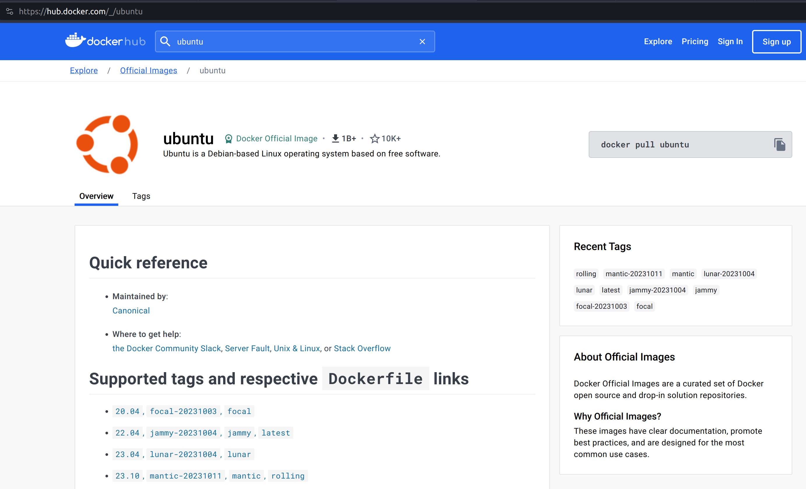
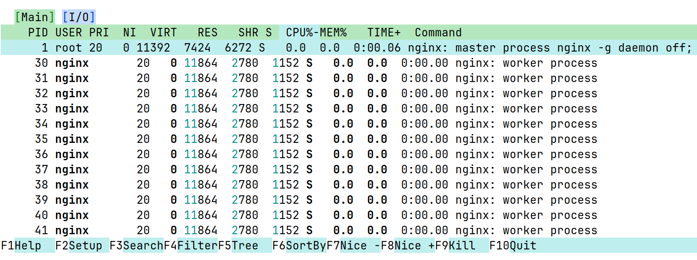

Docker: high-quality drop shipping
==================================

.. _Docker Website: https://docs.docker.com/get-started/overview/

Docker is a toolset that allows for the containerization of applications.

Think of it as a virtual machine (e.g. Virtualbox, KVM, QEMU, VMWare, Hyper-V),
but a lot slimmer, since there is no hardware switching happening between the
host and the guest operating systems.

The container replaces the userspace of the host operating system, isolating
its dependencies from the host system, allowing for development without the
interference of third-party tools that may spread dependencies around like crazy.

Much more information about Docker can be found in their `Docker Website`_.

Rootless Docker
---------------

.. _Rootless Docker: https://docs.docker.com/engine/security/rootless/

While Docker is awesome, the default installation via `apt install docker`
usually results in a Docker installation that is capable of escalating
privileges and exposing the host operating system by requiring sudo to run.

This can be really dangerous if proper security practices are not followed.
For people who don't care, good like. For those that do, install the
`Rootless Docker`_ version.

First steps
-----------

Really basic stuff regarding docker. Can also be used as a cheatsheet in
case your memory is as bad as mine.

Looking for a pre-built container image
---------------------------------------

.. _Docker Hub: https://hub.docker.com/

One of the things that popularized Docker were the pre-built container
images available at `Docker Hub`_. Some of which are just a few hundred
megabytes in size, allowing for a single consumer-level machine to host
and test a project in several linux distributions.

Ubuntu, for example, has multiple containers, one for each release
(``20.04``, ``22.04``, ``23.04``, ``23.10``), plus additional tags
for ``latest`` and ``rolling``.

To download one of the ubuntu images, ``docker image pull`` specifying
the container image name and tag:

.. sourcecode:: console

    $ docker image pull ubuntu:22.04
    22.04: Pulling from library/ubuntu
    aece8493d397: Pull complete
    Digest: sha256:2b7412e6465c3c7fc5bb21d3e6f1917c167358449fecac8176c6e496e5c1f05f
    Status: Downloaded newer image for ubuntu:22.04
    docker.io/library/ubuntu:22.04

You can check the container image was properly downloaded by running ``docker image ls``:

.. sourcecode:: console

    $ docker image ls
    REPOSITORY   TAG       IMAGE ID       CREATED       SIZE
    ubuntu       22.04     e4c58958181a   7 weeks ago   77.8MB

Container images by themselves, however, don't do anything.
We need to create a container first.

Creating the first container
----------------------------

We need to attach it to a container, that will use it as its base disk drive (e.g. ``/``).

To do that, we use ``docker container create`` command:

.. sourcecode:: console

    $ docker container create --name mycontainer ubuntu:22.04
    d60703e8847a1845e9e7566aa8bd2a0273d9cacdd9ebff725e6ed600e3c98dcf

That container will be created but will not be running all by itself.
We can double check this is the case with ``docker container ls``, which shows running
containers, and ``docker container ls -a``, which shows all containers.

.. sourcecode:: console

    $ docker container ls

    $ docker container ls -a
    CONTAINER ID   IMAGE          COMMAND       CREATED          STATUS    PORTS     NAMES
    d60703e8847a   ubuntu:22.04   "/bin/bash"   14 seconds ago   Created             mycontainer

Note that we passed a name for the container when creating it. That is for ease of use.
If you don't pass it, you will need to refer to the container via its Container ID (the
gigantic hexadecimal string you saw printed before, or its shorthand shown above).

To remove a container, use ``docker container rm containername``.

.. sourcecode:: console

    $ docker container ls -a
    CONTAINER ID   IMAGE          COMMAND       CREATED          STATUS    PORTS     NAMES
    d60703e8847a   ubuntu:22.04   "/bin/bash"   14 seconds ago   Created             mycontainer
    $ docker container rm mycontainer
    mycontainer
    $ docker container ls -a
    CONTAINER ID   IMAGE          COMMAND       CREATED          STATUS    PORTS     NAMES
    $ docker container create --name mycontainer ubuntu:22.04
    306b5af9ab3bbae1e0049a456ca4e420e571d9a288a53c60a2a596525f0c15af
    $ docker container ls -a
    CONTAINER ID   IMAGE          COMMAND       CREATED          STATUS    PORTS     NAMES
    306b5af9ab3b   ubuntu:22.04   "/bin/bash"   14 seconds ago   Created             mycontainer

Now we will have a container that can be run. We can run interactively, or non-interactively.
Below we see each case separately.

Running non-interactively
-------------------------

In this mode, we expect to run a bunch of services to run in the background as daemons.
The container is supposed to start them right-away, and they will continue to run until
the container is stopped.

We can use ``docker start container`` to start an existing container.

.. sourcecode:: console

    $ docker start mycontainer
    mycontainer

This means our container was successfully started. To check if it is running,
we can use ``docker container ls -a``.

.. sourcecode:: console

    $ docker container ls -a
    CONTAINER ID   IMAGE          COMMAND       CREATED          STATUS                      PORTS     NAMES
    306b5af9ab3b   ubuntu:22.04   "/bin/bash"   23 minutes ago   Exited (0) 12 seconds ago             mycontainer

As we can see, it was executed, but started right away because the container image
``entry-point`` is set to the interactive ``bash`` command, which won't receive any commands.

To exemplify how a container image with a background service would behave, we
can use a different container image using a brand new command:
``docker run -d --name container_name container_image:tag`` to fetch the container image,
create a new container and start it detached in the background (``-d``).

.. sourcecode:: console

    $ docker run -d --name nginx nginx:latest
    Unable to find image 'nginx:latest' locally
    latest: Pulling from library/nginx
    1f7ce2fa46ab: Pull complete
    9b16c94bb686: Pull complete
    9a59d19f9c5b: Pull complete
    9ea27b074f71: Pull complete
    c6edf33e2524: Pull complete
    84b1ff10387b: Pull complete
    517357831967: Pull complete
    Digest: sha256:10d1f5b58f74683ad34eb29287e07dab1e90f10af243f151bb50aa5dbb4d62ee
    Status: Downloaded newer image for nginx:latest
    d2f93616ff56bc84b1f057f44c3756fea909ae58ee9a3d736daa054bcf870ca8
    $ docker container ls -a
    CONTAINER ID   IMAGE          COMMAND                  CREATED          STATUS                     PORTS     NAMES
    d2f93616ff56   nginx:latest   "/docker-entrypoint.…"   15 seconds ago   Up 15 seconds              80/tcp    nginx
    306b5af9ab3b   ubuntu:22.04   "/bin/bash"              27 minutes ago   Exited (0) 4 minutes ago             mycontainer

As we can see, the nginx container is up and running right away. And will continue like that until stopped.
To hop into the terminal of the container and interact with the server container, we use
``docker exec -it container command``.

.. sourcecode:: console

    $ docker exec -it nginx bash
    root@d2f93616ff56:/# apt update
    Get:1 http://deb.debian.org/debian bookworm InRelease [151 kB]
    Get:2 http://deb.debian.org/debian bookworm-updates InRelease [52.1 kB]
    Get:3 http://deb.debian.org/debian-security bookworm-security InRelease [48.0 kB]
    Get:4 http://deb.debian.org/debian bookworm/main amd64 Packages [8780 kB]
    Get:5 http://deb.debian.org/debian bookworm-updates/main amd64 Packages [6668 B]
    Get:6 http://deb.debian.org/debian-security bookworm-security/main amd64 Packages [105 kB]
    Fetched 9143 kB in 5s (1909 kB/s)
    Reading package lists... Done
    Building dependency tree... Done
    Reading state information... Done
    1 package can be upgraded. Run 'apt list --upgradable' to see it.
    root@d2f93616ff56:/# apt install top
    Reading package lists... Done
    Building dependency tree... Done
    Reading state information... Done
    The following additional packages will be installed:
      libgpm2 libncursesw6 libnl-3-200 libnl-genl-3-200
    Suggested packages:
      lm-sensors lsof strace gpm
    The following NEW packages will be installed:
      htop libgpm2 libncursesw6 libnl-3-200 libnl-genl-3-200
    0 upgraded, 5 newly installed, 0 to remove and 1 not upgraded.
    Need to get 385 kB of archives.
    After this operation, 1101 kB of additional disk space will be used.
    Do you want to continue? [Y/n] y
    Get:1 http://deb.debian.org/debian bookworm/main amd64 libncursesw6 amd64 6.4-4 [134 kB]
    Get:2 http://deb.debian.org/debian bookworm/main amd64 libnl-3-200 amd64 3.7.0-0.2+b1 [63.1 kB]
    Get:3 http://deb.debian.org/debian bookworm/main amd64 libnl-genl-3-200 amd64 3.7.0-0.2+b1 [21.6 kB]
    Get:4 http://deb.debian.org/debian bookworm/main amd64 htop amd64 3.2.2-2 [152 kB]
    Get:5 http://deb.debian.org/debian bookworm/main amd64 libgpm2 amd64 1.20.7-10+b1 [14.2 kB]
    Fetched 385 kB in 0s (793 kB/s)
    debconf: delaying package configuration, since apt-utils is not installed
    Selecting previously unselected package libncursesw6:amd64.
    (Reading database ... 7590 files and directories currently installed.)
    Preparing to unpack .../libncursesw6_6.4-4_amd64.deb ...
    Progress: [  0%] [.....................................................................]
    Unpacking libncursesw6:amd64 (6.4-4) ..................................................]
    Selecting previously unselected package libnl-3-200:amd64..............................]
    Preparing to unpack .../libnl-3-200_3.7.0-0.2+b1_amd64.deb ...
    Unpacking libnl-3-200:amd64 (3.7.0-0.2+b1) ............................................]
    Selecting previously unselected package libnl-genl-3-200:amd64.........................]
    Preparing to unpack .../libnl-genl-3-200_3.7.0-0.2+b1_amd64.deb ...
    Unpacking libnl-genl-3-200:amd64 (3.7.0-0.2+b1) ...###############.....................]
    Selecting previously unselected package htop.#######################...................]
    Preparing to unpack .../htop_3.2.2-2_amd64.deb ...
    Unpacking htop (3.2.2-2) ...#########################################..................]
    Selecting previously unselected package libgpm2:amd64.################.................]
    Preparing to unpack .../libgpm2_1.20.7-10+b1_amd64.deb ...
    Unpacking libgpm2:amd64 (1.20.7-10+b1) ...#############################................]
    Setting up libgpm2:amd64 (1.20.7-10+b1) ...#############################...............]
    Progress: [ 52%] [######################################################...............]
    Setting up libncursesw6:amd64 (6.4-4) ...################################..............]
    Progress: [ 62%] [########################################################.............]
    Setting up libnl-3-200:amd64 (3.7.0-0.2+b1) ...############################............]
    Progress: [ 71%] [##########################################################...........]
    Setting up libnl-genl-3-200:amd64 (3.7.0-0.2+b1) ...##########################.........]
    Progress: [ 81%] [#############################################################........]
    Setting up htop (3.2.2-2) ...###################################################.......]
    Progress: [ 90%] [###############################################################......]
    Processing triggers for libc-bin (2.36-9+deb12u3) ...#############################.....]
    root@d2f93616ff56:/# htop

After installing ``htop`` and running it, we get the list of running processes within the container.

After finishing our work, we can exit the container with a simple ``exit`` command.
And then, we can stop our container with ``docker container stop containername``.

.. sourcecode:: console

    root@d2f93616ff56:/# exit
    $ docker container stop nginx
    nginx
    $ docker container ls -a
    CONTAINER ID   IMAGE          COMMAND                  CREATED          STATUS                      PORTS     NAMES
    d2f93616ff56   nginx:latest   "/docker-entrypoint.…"   13 minutes ago   Exited (0) 9 seconds ago              nginx
    306b5af9ab3b   ubuntu:22.04   "/bin/bash"              40 minutes ago   Exited (0) 17 minutes ago             mycontainer

Running interactively
---------------------

In this mode, we jump straight to the container command line. Super useful for testing,
not so much for deployment. Since it is typical to throw away test containers right away,
it is not really necessary to give them a name.

The command for it is ``docker run -it image_name:tag``

.. sourcecode:: console

    $ docker run -it ubuntu:23.04
    Unable to find image 'ubuntu:23.04' locally
    23.04: Pulling from library/ubuntu
    f93f952dad40: Pull complete
    Digest: sha256:51e70689b125fcc2e800f5efb7ba465dee85ede9da9c268ff5599053c7e52b77
    Status: Downloaded newer image for ubuntu:23.04
    root@bf6ecf1cecd0:/# exit
    $ docker container ls -a
    CONTAINER ID   IMAGE          COMMAND                  CREATED          STATUS                     PORTS     NAMES
    bf6ecf1cecd0   ubuntu:23.04   "/bin/bash"              50 seconds ago   Exited (0) 7 seconds ago             festive_mclean
    306b5af9ab3b   ubuntu:22.04   "/bin/bash"              4 minutes ago    Created                              mycontainer
    d2f93616ff56   nginx:latest   "/docker-entrypoint.…"   22 minutes ago   Exited (0) 9 minutes ago             nginx

As we can see above, we now have a new container with a randomly assigned name (``festive_mclean``)
with the ``ubuntu:23.04`` docker image.

Cleaning up containers and images
---------------------------------

All of these containers are stopped, and their images won't be removed from your system until
containers using them are removed. To remove all stopped containers, use ``docker container prune``.

.. sourcecode:: console

    $ docker container prune
    WARNING! This will remove all stopped containers.
    Are you sure you want to continue? [y/N] y
    Deleted Containers:
    bf6ecf1cecd0cb540054dbcea3b4dc14492b321d33ea82c3a649c17226230bd8
    306b5af9ab3bbae1e0049a456ca4e420e571d9a288a53c60a2a596525f0c15af
    d2f93616ff56bc84b1f057f44c3756fea909ae58ee9a3d736daa054bcf870ca8

    Total reclaimed space: 20.63MB

Then, we can remove the docker container images with ``docker image prune -a``:

.. sourcecode:: console

    $ docker image prune -a
    WARNING! This will remove all images without at least one container associated to them.
    Are you sure you want to continue? [y/N] y
    Deleted Images:
    untagged: ubuntu:23.04
    untagged: ubuntu@sha256:51e70689b125fcc2e800f5efb7ba465dee85ede9da9c268ff5599053c7e52b77
    deleted: sha256:639282825872ec6978281e00795f8f02e3b752112dfa01a5f55a19a0f6cf47dc
    deleted: sha256:6896079fa03f4ec6953883a0645397ecf3d805a9a692b231b48188bfa5d489bf
    untagged: ubuntu:22.04
    untagged: ubuntu@sha256:2b7412e6465c3c7fc5bb21d3e6f1917c167358449fecac8176c6e496e5c1f05f
    deleted: sha256:e4c58958181a5925816faa528ce959e487632f4cfd192f8132f71b32df2744b4
    deleted: sha256:256d88da41857db513b95b50ba9a9b28491b58c954e25477d5dad8abb465430b
    untagged: nginx:latest
    untagged: nginx@sha256:10d1f5b58f74683ad34eb29287e07dab1e90f10af243f151bb50aa5dbb4d62ee
    deleted: sha256:a6bd71f48f6839d9faae1f29d3babef831e76bc213107682c5cc80f0cbb30866
    deleted: sha256:fe7723b2df19ccf75328cb1f39c90c2332679144231501f3d4d00f51b16c2867
    deleted: sha256:c0f3f17b019abbcfeb0c162054786ea8087ca792a2191a79f03040a8cd98f41d
    deleted: sha256:32cfe66e62a5f36abf128703007285e1a3b9078f5b33a367df1534399065cc70
    deleted: sha256:8713bfa322a66040e882b7822dc0c110a68cfafd3bb37332fdbb9426171d7ec9
    deleted: sha256:253c039db964b57be02d9bb0f3d6916b7948687b4f6f4fc681644a419a47979d
    deleted: sha256:2c235ef4cca1fbb74e3a7aa47e654fe943bc0c2becbdd4d6af7cbf9e375fe08a
    deleted: sha256:92770f546e065c4942829b1f0d7d1f02c2eb1e6acf0d1bc08ef0bf6be4972839

    Total reclaimed space: 334.9MB

We can check if all containers and images were correctly removed with
``docker container ls -a`` and ``docker image ls -a``.

.. sourcecode:: console

    $ docker container ls -a
    CONTAINER ID   IMAGE     COMMAND   CREATED   STATUS    PORTS     NAMES
    $ docker image ls -a
    REPOSITORY   TAG       IMAGE ID   CREATED   SIZE

Next, we check how to expose services hosted inside the container to the external
network from which the host is part of.

Exposing ports to the container
-------------------------------

Since we can containerize a service inside a container, we need to expose its
services via network ports.

This is done by specifying a port mapping with
``docker container create -p external_port:internal_port ...``
or ``docker run -it -p external_port:internal_port ...``.

Let's try with the following Python script running within the container.

.. sourcecode:: console

    $ docker run -it -p 80:1234 ubuntu:22.04
    Unable to find image 'ubuntu:22.04' locally
    22.04: Pulling from library/ubuntu
    aece8493d397: Pull complete
    Digest: sha256:2b7412e6465c3c7fc5bb21d3e6f1917c167358449fecac8176c6e496e5c1f05f
    Status: Downloaded newer image for ubuntu:22.04
    docker: Error response from daemon: driver failed programming external connectivity
    on endpoint distracted_ramanujan (7967363fec04d2d4ac9899ba0987fa7831d9fcd26509dc200ce48ac648809840):
    Error starting userland proxy: error while calling PortManager.AddPort(): cannot expose privileged port 80,
    you can add 'net.ipv4.ip_unprivileged_port_start=80' to /etc/sysctl.conf (currently 1024), or set
    CAP_NET_BIND_SERVICE on rootlesskit binary, or choose a larger port number (>= 1024): listen tcp4
    0.0.0.0:80: bind: permission denied.
    ERRO[0008] error waiting for container:

Since I am running with Rootless Docker, Linux forbids ports lower than 1024. Additional permissions
can be explicitly granted that would allow for that, but that is a topic for later.

Let's try a different port number.

.. sourcecode:: console

    $ docker run -it -p 1234:8000 ubuntu:22.04
    root@44dc2e6581eb:/# apt update && apt install -y python3
    ...
    root@44dc2e6581eb:/# python3 -m http.server
    Serving HTTP on 0.0.0.0 port 8000 (http://0.0.0.0:8000/) ...

With our server running inside the container, we can then try to access it from our
host machine from a different terminal.

.. sourcecode:: console

    $ wget http://127.0.0.1:1234
    --2023-11-28 11:48:46--  http://127.0.0.1:1234/
    Connecting to 127.0.0.1:1234... connected.
    HTTP request sent, awaiting response... 200 OK
    Length: 1063 (1,0K) [text/html]
    Saving to: ‘index.html’

    index.html        100%[==============================]   1,04K  --.-KB/s    in 0s

    2023-11-28 11:48:46 (55,5 MB/s) - ‘index.html’ saved [1063/1063]
    $ cat index.html
    <!DOCTYPE HTML PUBLIC "-//W3C//DTD HTML 4.01//EN" "http://www.w3.org/TR/html4/strict.dtd">
    <html>
    <head>
    <meta http-equiv="Content-Type" content="text/html; charset=utf-8">
    <title>Directory listing for /</title>
    </head>
    <body>
    <h1>Directory listing for /</h1>
    

    <ul>
    <li><a href=".dockerenv">.dockerenv</a></li>
    <li><a href="bin/">bin@</a></li>
    <li><a href="boot/">boot/</a></li>
    <li><a href="dev/">dev/</a></li>
    <li><a href="etc/">etc/</a></li>
    ...

As shown above, we connected to the server inside the container and fetched the list
of files in the current directory of the server (which is the root directory of the container).

On the server side, we get the following updates:

.. sourcecode:: console

    root@c37de818fc9d:/# python3 -m http.server
    Serving HTTP on 0.0.0.0 port 8000 (http://0.0.0.0:8000/) ...
    172.17.0.1 - - [28/Nov/2023 14:48:46] "GET / HTTP/1.1" 200 -

This is very useful, but still limited since files inside the container are stored
in a docker volume. We see how to expose the file system next.

Mounting external drives into the container
-------------------------------------------

Super useful. Configuration files and data should always be stored outside of the
container, allowing for proper backup and recovery in case the container and its
volumes get deleted.

The mapping is done similarly to the ports seen above.
``docker container create -v external_path:internal_path ...``
or ``docker run -it -v external_path:internal_path ...``.

Let's see an example.

.. sourcecode:: console

    $ mkdir test
    $ mkdir test/banana
    $ docker run -it -v ./test:/internal/mapping/of/test ubuntu:22.04
    root@217bab8dd20e:/# cd /internal/mapping/of/test/
    root@217bab8dd20e:/internal/mapping/of/test# ls
    banana
    root@217bab8dd20e:/internal/mapping/of/test# rm -R banana
    root@217bab8dd20e:/internal/mapping/of/test# exit
    exit
    $ ls ./test

As we can see, the directory ``banana`` was created inside the ``test`` directory.
We then mounted ``test`` as ``/internal/mapping/of/test`` inside of the container.

The container then walked to that directory, listed the ``banana`` directory and
finally deleted it.

After exiting the container, we can see the removal of the ``banana`` directory was
propagated to the external directory as expected.

At this point, you have enough knowledge to use Docker for general purpose testing,
but not for containerizing your own service for redistribution. We learn this next.

Building your own container
---------------------------

Building your container is just as easy as 1-2-3.

1. Write your setup within Dockerfile
2. Build your Docker container image
3. Testing your container

Here we enter in details on how to perform each step.

1 Write your setup within Dockerfile
************************************

The ``Dockerfile`` file contains the recipe of your container.

Let's build a container with the python webserver from before, but now properly setup.

.. sourcecode:: text

    # Our base image
    FROM ubuntu:23.04
    # Install the required packages
    RUN apt update && apt install -y python3
    # Expose service port externally, mapping to the host port
    EXPOSE 8000
    # Copy www directory from the current host build directory to the container
    COPY "www" "/www"
    # Start the service
    CMD ["python3", "-m", "http.server", "--directory", "/www"]

Now we need a ``www`` directory.

.. sourcecode:: console

    $ mkdir www

After adding our files to host to the www directory, we can proceed to build the container image.

2 Build your Docker container image
***********************************

The ``docker build`` command accepts a tag (``-t``) that will be used to identify the container
image later (e.g. ``ubuntu:20.04``), and a Dockerfile (``-f``) as parameters. The last argument
is always a path to a directory (``.``) that will be copied to within the container build procedure, and
will be discarded later, unless explicitly copied to the container.

.. sourcecode:: console

    $ docker build -t myimage:latest -f Dockerfile .
    DEPRECATED: The legacy builder is deprecated and will be removed in a future release.
                Install the buildx component to build images with BuildKit:
                https://docs.docker.com/go/buildx/

    Sending build context to Docker daemon  92.78MB
    Step 1/5 : FROM ubuntu:23.04
    23.04: Pulling from library/ubuntu
    f93f952dad40: Pull complete
    Digest: sha256:51e70689b125fcc2e800f5efb7ba465dee85ede9da9c268ff5599053c7e52b77
    Status: Downloaded newer image for ubuntu:23.04
     ---> 639282825872
    Step 2/5 : RUN apt update && apt install -y python3
     ---> Running in 9e9cae0fc4c9
    ...
    Setting up python3.11 (3.11.4-1~23.04.1) ...
    Setting up python3 (3.11.2-1) ...
    running python rtupdate hooks for python3.11...
    running python post-rtupdate hooks for python3.11...
    Processing triggers for libc-bin (2.37-0ubuntu2.1) ...
    Processing triggers for ca-certificates (20230311ubuntu0.23.04.1) ...
    Updating certificates in /etc/ssl/certs...
    0 added, 0 removed; done.
    Running hooks in /etc/ca-certificates/update.d...
    done.
    Removing intermediate container 9e9cae0fc4c9
     ---> 383168439a34
    Step 3/5 : EXPOSE 8000
     ---> Running in fb46e3841334
    Removing intermediate container fb46e3841334
     ---> 5b015f3c8a14
    Step 4/5 : COPY "www" "/www"
     ---> 446f0c45951c
    Step 5/5 : CMD ["python3", "-m", "http.server", "--directory", "/www"]
     ---> Running in 98cb4707eb13
    Removing intermediate container 98cb4707eb13
     ---> 5d4e7322d63d
    Successfully built 5d4e7322d63d
    Successfully tagged myimage:latest

And voilà, our container image is ready.
Of course, we need to check it before deploying it in production.

3. Testing your container
*************************

Let's first start it in non-interactive mode to see if the webserver is running.

.. sourcecode:: console

    $ docker container create --name mycontainer myimage:latest
    069b16633dcf913bf2f68b95e523fad00373314b10c8080e7e485418fe5c5ade
    $ docker start mycontainer
    mycontainer
    $ gabriel@Ryzen:/mnt/dev/tools/source/ORAN_testbed_docs$ docker container ls
    CONTAINER ID   IMAGE            COMMAND                  CREATED          STATUS         PORTS      NAMES
    069b16633dcf   myimage:latest   "python3 -m http.ser…"   13 seconds ago   Up 3 seconds   8000/tcp   mycontainer

Awesome. Now we can check if the ``www`` directory was properly copied to the
root of the container.

.. sourcecode:: console

    $ docker exec mycontainer ls | grep www
    www
    $ docker exec -it mycontainer bash
    root@069b16633dcf:/# cd www
    root@069b16633dcf:/www#

As we can see, yes, it was copied correctly.

Now we can stop and tear down the test container.

.. sourcecode:: console

    $ docker container stop mycontainer
    mycontainer
    $ docker container prune
    WARNING! This will remove all stopped containers.
    Are you sure you want to continue? [y/N] y
    Deleted Containers:
    069b16633dcf913bf2f68b95e523fad00373314b10c8080e7e485418fe5c5ade
    217bab8dd20ef8204ffd34d69abac05315ce3dae8e4f25b523a59dfd7b504bb1
    c37de818fc9dc6fe67d9e5a74f7034340ea2a6d5bf6935450725a2a5ac083e02
    a7cc7fce8ab8b42475f28e9757f86c6af7e18ef451670165f699725ad9526fc9
    4ed197f67ab844e730c350f429cbe2eeaa52c7693d9159954cacc6fcb682f8ff
    44dc2e6581ebd852c79c1df01bca0c13d9ef4efa1f0538f45a75b5ba2e8c0686
    0a99ba589dac7c2ddc30df552ab8328c16c46f77297033382b727af29b035323

    Total reclaimed space: 303.5MB

.. _Gitlab Container Registry: https://docs.gitlab.com/ee/user/packages/container_registry/
.. _Docker Registry: https://hub.docker.com/_/registry

The last missing piece is publishing our container. Either publicly via
`Docker Hub`_, as a `Gitlab Container Registry`_, or privately to a `Docker Registry`_.

Publishing your own container
-----------------------------

Let's publish our container to our own private registry, typically done in organizations.

To start the registry using newly acquired Docker knowledge, run:

.. sourcecode:: console

    $ docker run -d -p 5000:5000 --restart always --name registry registry:2
    Unable to find image 'registry:2' locally
    2: Pulling from library/registry
    96526aa774ef: Pull complete
    834bccaa730c: Pull complete
    87a69098c0a9: Pull complete
    afc17120a9f7: Pull complete
    e5ac04f3acf5: Pull complete
    Digest: sha256:8a60daaa55ab0df4607c4d8625b96b97b06fd2e6ca8528275472963c4ae8afa0
    Status: Downloaded newer image for registry:2
    2406929926a9f59fb0b72d4fbabc0836da6eb3b7a8a158fea575a9124d262af6
    $ docker container ls
    CONTAINER ID   IMAGE        COMMAND                  CREATED          STATUS          PORTS                                       NAMES
    2406929926a9   registry:2   "/entrypoint.sh /etc…"   13 seconds ago   Up 12 seconds   0.0.0.0:5000->5000/tcp, :::5000->5000/tcp   registry

Now that we have the registry running, we can push our image ``myimage:latest`` to the registry.

.. sourcecode:: console

    $ docker tag myimage:latest localhost:5000/myimage:latest
    $ docker push localhost:5000/myimage:latest
    The push refers to repository [localhost:5000/myimage]
    2125872a3000: Pushed
    41447c8a4634: Pushed
    6896079fa03f: Pushed
    latest: digest: sha256:46f28507cffbe4576ab7aced7de94b73cc98cac62bcb77d1ade8417d524ee053 size: 947

To check that this is not a fluke, let's first remove the local container image.

.. sourcecode:: console

    $ docker image prune -a
    WARNING! This will remove all images without at least one container associated to them.
    Are you sure you want to continue? [y/N] y
    Deleted Images:
    untagged: ubuntu:22.04
    untagged: ubuntu@sha256:2b7412e6465c3c7fc5bb21d3e6f1917c167358449fecac8176c6e496e5c1f05f
    deleted: sha256:e4c58958181a5925816faa528ce959e487632f4cfd192f8132f71b32df2744b4
    deleted: sha256:256d88da41857db513b95b50ba9a9b28491b58c954e25477d5dad8abb465430b
    untagged: ubuntu:23.04
    untagged: ubuntu@sha256:51e70689b125fcc2e800f5efb7ba465dee85ede9da9c268ff5599053c7e52b77
    untagged: myimage:latest
    untagged: localhost:5000/myimage:latest
    untagged: localhost:5000/myimage@sha256:46f28507cffbe4576ab7aced7de94b73cc98cac62bcb77d1ade8417d524ee053
    ...
    deleted: sha256:6896079fa03f4ec6953883a0645397ecf3d805a9a692b231b48188bfa5d489bf

    Total reclaimed space: 235.4MB

Now let's download it from the registry:

.. sourcecode:: console

    $ docker image pull localhost:5000/myimage:latest
    latest: Pulling from myimage
    850c66215014: Pull complete
    5f7f1a637872: Pull complete
    dbf367f02948: Pull complete
    Digest: sha256:46f28507cffbe4576ab7aced7de94b73cc98cac62bcb77d1ade8417d524ee053
    Status: Downloaded newer image for localhost:5000/myimage:latest
    localhost:5000/myimage:latest

And we can test it again:

.. sourcecode:: console

    $ docker run -it localhost:5000/myimage:latest
    Serving HTTP on 0.0.0.0 port 8000 (http://0.0.0.0:8000/) ...
    ^C
    Keyboard interrupt received, exiting.

