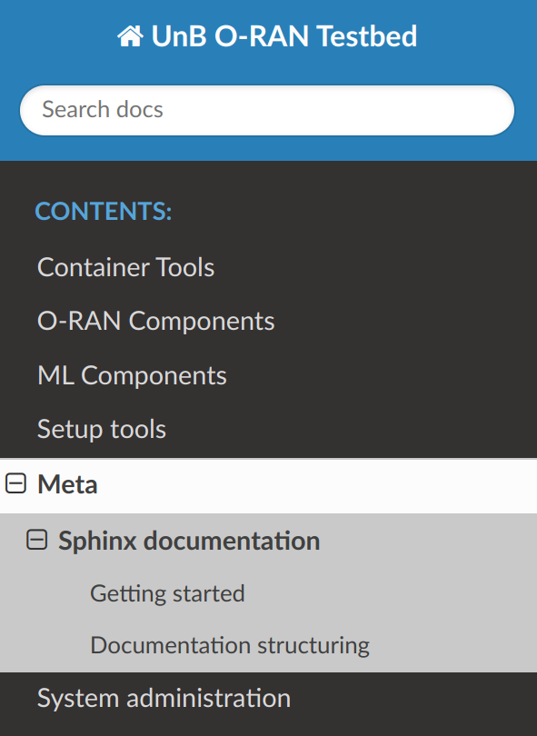
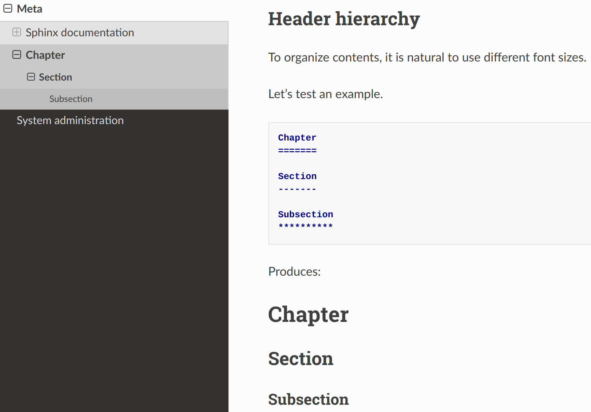

Sphinx documentation
====================

.. _Sphinx: https://www.sphinx-doc.org/en/master/

Our testbed documentation is written with `Sphinx`_.
Sphinx uses a markdown syntax that is pretty easy to use,
and can easily incorporate images and code blocks, plus
manage document hierarchy for complex or diverse manuals,
such as this one.

Getting started
---------------

To get started, we first need to have Python, pip and venv installed.

On Ubuntu:

.. sourcecode:: console

    sudo apt install python3 python3-pip python3-venv

Then, we need to install sphinx main package and the theme
that we use. But we are going to do it in a virtual environment,
to clearly separate dependencies, which is a good practice.

We have the necessary steps in the ``setup.sh`` script, which
contains the following:

.. sourcecode:: bash

    #!/usr/bin/env bash

    python3 -m venv testbed
    source ./testbed/bin/activate
    python3 -m pip install sphinx sphinx-rtd-theme

.. _shebang: https://linuxhandbook.com/shebang/

The first line is the `shebang`_, which lets bash identify
what program it should use to parse the current file.

The second line creates the virtual environment called ``testbed``.

The third line activates the virtual environment, where
calling python3 will now invoke a separate version contained
in the ``testbed`` directory.

The fourth, and last, line installs sphinx and our chosen theme.

Now we can proceed to build the documentation with the
``build_docs.sh`` script, which contains the following:

.. sourcecode:: bash

    #!/usr/bin/env bash

    source ./testbed/bin/activate
    cd ./docs && make html

Again, the first line is a shebang to indicate how to process the file.

The second line activates the virtual environment.

The third, and last, line walks into the ``docs`` subdirectory and builds
the html version of the documentation.

After running it, you should see no warnings.

.. sourcecode:: console

    $ ./build_docs.sh
    Running Sphinx v7.2.6
    loading pickled environment... done
    building [mo]: targets for 0 po files that are out of date
    writing output...
    building [html]: targets for 1 source files that are out of date
    updating environment: 0 added, 1 changed, 0 removed
    reading sources... [100%] index
    looking for now-outdated files... none found
    pickling environment... done
    checking consistency... done
    preparing documents... done
    copying assets... copying static files... done
    copying extra files... done
    done
    writing output... [100%] index
    generating indices... genindex done
    writing additional pages... search done
    dumping search index in English (code: en)... done
    dumping object inventory... done
    build succeeded.

    The HTML pages are in build/html.

Now we can inspect our freshly built documentation in ``docs/build/html/index.html``.

Documentation structuring
-------------------------

We already have a few sections, so let's explore them.

.. sourcecode:: console

    $ tree ./docs/source/
    ./docs/source/
    ├── conf.py
    ├── container-tools
    │   ├── docker-compose.rst
    │   ├── docker.rst
    │   ├── helm.rst
    │   ├── img
    │   │   ├── bitnami-nginx.png
    │   │   ├── bitnami-nginx-templates.png
    │   │   ├── bitnami-nginx-templates-ports.png
    │   │   ├── nginx-container-htop.png
    │   │   ├── ubuntu-docker-hub-page.png
    │   │   └── wordpress-wizard.png
    │   └── kubernetes.rst
    ├── container-tools.rst
    ├── index.rst
    ├── meta
    │   └── sphinx-documentation.rst
    ├── meta.rst
    ├── ml-components
    │   └── mlflow.rst
    ├── ml-components.rst
    ├── oran-components
    │   ├── oran-sc.rst
    │   └── srs-ran.rst
    ├── oran-components.rst
    ├── setup-tools
    │   ├── ansible.rst
    │   ├── arm-builds.rst
    │   └── multipass.rst
    ├── setup-tools.rst
    ├── _static
    ├── sysadmin
    │   ├── img
    │   │   └── testbed_stack.png
    │   ├── testbed.rst
    │   └── user-management.rst
    ├── sysadmin.rst
    └── _templates
    
    10 directories, 28 files

Looking at the top-level directory, we can see the main document (``index.rst``),
which unites all document sections (``.rst`` files).

.. sourcecode:: reST

    .. UnB O-RAN Testbed documentation master file, created by
       sphinx-quickstart on Mon Nov 27 17:06:02 2023.
       You can adapt this file completely to your liking, but it should at least
       contain the root `toctree` directive.

    Welcome to UnB O-RAN Testbed's documentation!
    ===========================================================

    .. toctree::
       :maxdepth: 3
       :caption: Contents:

       container-tools
       oran-components
       ml-components
       setup-tools
       meta
       sysadmin

    Indices and tables
    ==================

    * :ref:`genindex`
    * :ref:`modindex`
    * :ref:`search`

The important part of this file is the ``toctree`` declaration,
which basically works like a C/C++ includes, which effectively merges
the listed files (**file extensions can be omitted**) to the current one.

For the ``meta`` documentation, we have the respective ``meta.rst``
file with the following contents:

.. sourcecode:: reST

    Meta
    ====

    .. toctree::
       :maxdepth: 2
       :caption: Contents:

       meta/sphinx-documentation.rst
    
As we can see, we have the section title ``Meta``, which has its font size
adjusted by the ``====`` signs just below it.

So far, the ``Meta`` chapter has only this documentation regarding Sphinx,
contained in the ``meta/sphinx-documentation.rst`` file.

The ``sphinx-documentation.rst`` file has the actual documentation
regarding Sphinx.

.. sourcecode:: reST

   Sphinx documentation
   ====================

   .. _Sphinx: https://www.sphinx-doc.org/en/master/

   Our testbed documentation is written with `Sphinx`_.
   Sphinx uses a markdown syntax that is pretty easy to use,
   and can easily incorporate images and code blocks, plus
   manage document hierarchy for complex or diverse manuals,
   such as this one.

   Getting started
   ---------------

   To get started, we first need to have Python, pip and venv installed.

This produces the following document tree in the left-sidebar nagivation
menu.

Header hierarchy
----------------

To organize contents, it is natural to use different font sizes.

Let's test an example with the following chapter, section and subsection.

.. sourcecode:: reST

    Chapter
    =======

    Section
    -------

    Subsection
    **********

Not to screw up with the actual document, using just an image with the outputs.

External links
--------------

External links are pretty easy to handle, you first declare the link
then use it in the text as follows.

.. sourcecode:: reST

    .. _lalalalala: https://youtu.be/Xfg0QuhYVjE

    Here is the `lalalalala`_ video.

Which produces:

.. _lalalalala: https://youtu.be/Xfg0QuhYVjE

Here is the `lalalalala`_ video.

Cross-references
----------------

To reference another section of this documentation, use the name of the chapter,
section or subsection in the following way:

.. sourcecode:: reST

    :ref:`Multipass`

    :ref:`Cross-references`

Which produces:

:ref:`Multipass`

:ref:`Cross-references`

Including images
----------------

If your chapter does not have its own ``img`` image subdirectory, create it.
Then place the image there, and reference it in that chapter.

For example, the ``toctree`` image is included as follows:

.. sourcecode:: reST

    .. image:: img/toctree.png
       :width: 30%

Which produces

Including source code
---------------------

If you want to include source code, create a ``.. sourcecode:: LANGUAGE`` block,
with the ``LANGUAGE`` you want to use, which will allow for proper syntax colouring.

Common languages include Python, Cpp, Bash, Console, reST (markdown flavour used by Sphinx).

.. sourcecode:: reST

       .. sourcecode:: Cpp

            int main()
            {
              return 0;
            }

       .. sourcecode:: Python

            import time
            print(time.time())

       .. sourcecode:: Bash

           #!/usr/bin/env bash

           source ./testbed/bin/activate
           cd ./docs && make html

       .. sourcecode:: Console

           $ whoami
           gabriel

       .. sourcecode:: reST

           Subinception
           ************

Which produces the following:

.. sourcecode:: Cpp

     int main()
     {
       return 0;
     }

.. sourcecode:: Python

    import time
    print(time.time())

.. sourcecode:: Bash

    #!/usr/bin/env bash

    source ./testbed/bin/activate
    cd ./docs && make html

.. sourcecode:: Console

    $ whoami
    gabriel

.. sourcecode:: reST

    Subinception
    ************