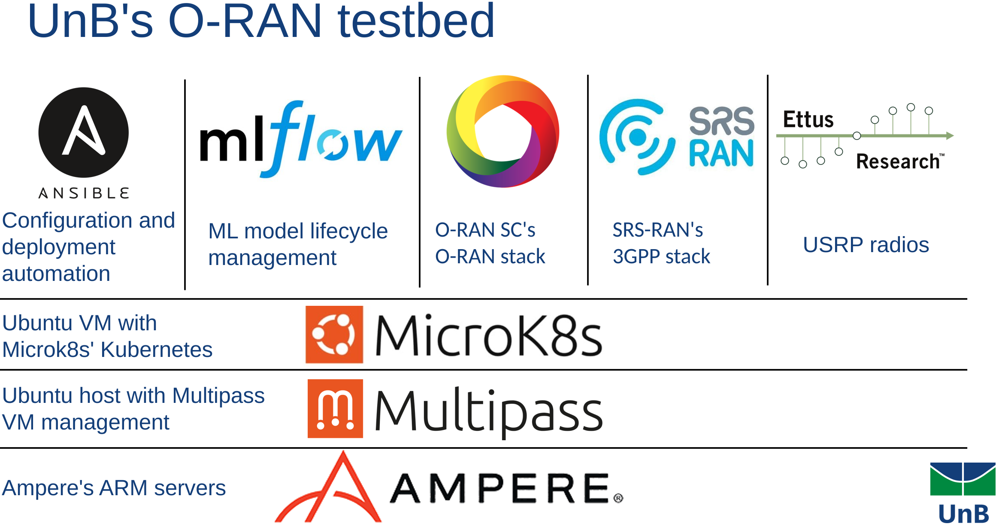

The testbed
===========

After multiple iterations and way too many problems, we finally settled our testbed setup.

The UnB testbed is composed of the following elements:

.. _Ampere Computing: https://amperecomputing.com/
.. _Ubuntu: https://ubuntu.com/
.. _Microk8s: https://microk8s.io/

- Awesome ARM servers donated by `Ampere Computing`_ (many thanks to the team, specially to Mahesh)
- `Ubuntu`_ as the server operating system
- :ref:`Multipass` as our VM Manager
  - We run a different VM per student and two main VMs for staging and production environments
- The VM's run Ubuntu as their operating systems
  - Those systems are prepared with Ansible for each different use scenario
- The VM's have pre-installed :ref:`Ansible`, :ref:`Docker`, `Microk8s`_ :ref:`Kubernetes` and :ref:`Helm` (with alias setup for ease-of-use)
- Machine learning model lifecycle is managed by :ref:`MlFlow`
- We use the :ref:`SRS-RAN` 3GPP stack with :ref:`O-RAN SC`'s O-RAN stack

